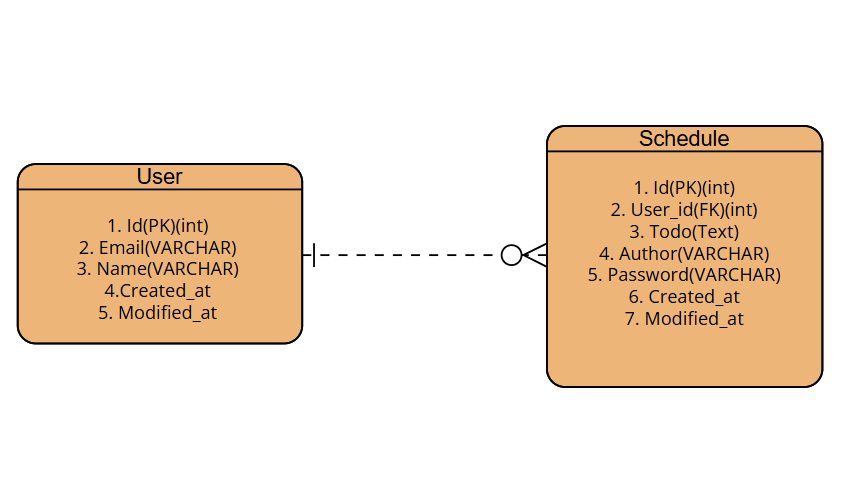

# kakao_tech_campus_hw2

## ERD diagram

## API specification

1. 일정 생성하기

- METHOD: POST
- URL(ex): http://localhost:8080/schedules?userId=1
- Body (JSON):
{
  "todo": "스터디 준비하기",
  "author": "user1@email.com",
  "password": "1234"
}

2. 단일 일정정 조회

- METHOD: GET
- URL(ex): http://localhost:8080/schedules/1

3. 해당 작성자의 전체 일정 조회

- METHOD: GET
- URL(ex): http://localhost:8080/schedules?author=user1@email.com

4. 일정 수정 (Update Schedule)
METHOD: PUT

- URL(ex): http://localhost:8080/schedules
- Body (JSON):
{
  "id": 1,
  "todo": "스터디 발표 준비하기",
  "author": "user1@email.com",
  "password": "1234"
}

5. 일정 삭제 (Delete Schedule)

- METHOD: DELETE
- URL(ex): http://localhost:8080/schedules/1?password=1234